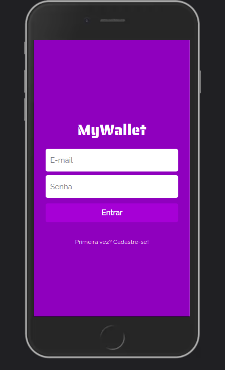

# My Wallet


<p align="center" >

</p>

Try it out now at https://projeto-14-my-wallet-frontend.vercel.app

## About

For now, my App has the folling features:

- Sign Up
- Login
- Add a new entry or withdraw
- Control your income and expenses


## Technologies
The following tools and frameworks were used in the construction of the project:<br>
<p>  
  
  
  
  
  
  

  
  
  
</p>

## How to run

1. Clone this repository
2. Clone the back-end repository at https://github.com/Ribeiro1300/My-Wallet_backend
3. Install dependencies
```bash
npm i
```
4. Run the front-end with
```bash
npm start
```

5. Access http://localhost:3000 on your browser and enjoy!
